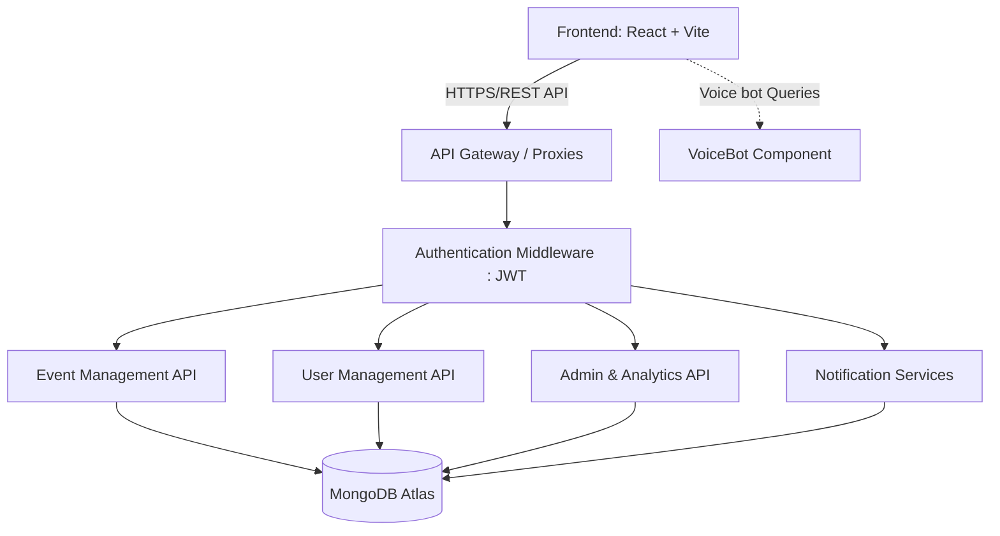

# System Architecture

The Event Management platform follows a modernized robust MERN stack architecture suitable for high-scalability configurations typical in Hackathons and production environments.

## High-Level Architecture

## Core Components
- **Frontend**: React-based UI integrated with Vite for fast HMR. It includes role-based dashboards (Admin, Student), event cataloging, analytics rendering, and a voice-powered bot component. Uses `axios` and native `fetch` combined with `VITE_API_URL` injected proxying.
- **Backend Node**: Express.js server providing routing for `events`, `users`, `auth`, `admin` capabilities. Includes secure JWT parsing and standardizing API structures.
- **Database Layer**: Maintained on MongoDB Atlas holding scalable collections of documents covering Event Registrations, Club Analytics, Notification queues, etc.
